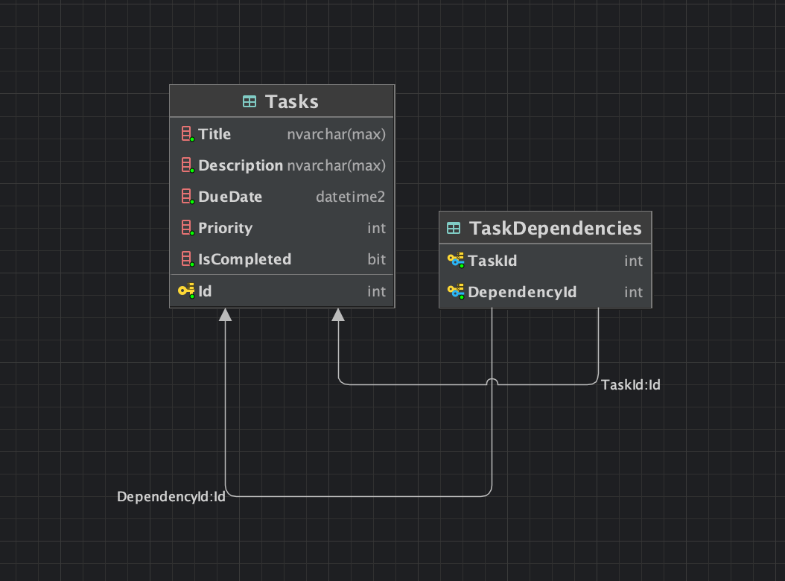
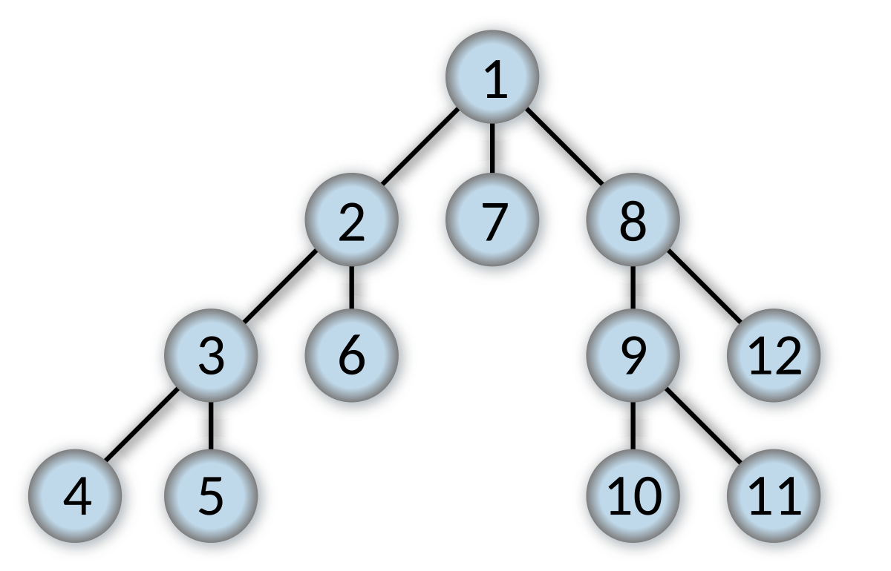

# Todo-List API

RESTful To‑Do List API built with ASP.NET Core .NET 8 and SQL Server, full docker for easy setup.

## Installation

### Prerequisites
- Docker
- Docker Compose
- .NET 8 SDK (for migrations)

### Setup Steps

1️⃣ Clone the repository:
```bash
git clone https://github.com/thinhphat04/Todo-List.git
cd Todo-Api
```

2️⃣ Build and run using Docker Compose:
```bash
docker-compose up --build -d
```

3️⃣ Run database migrations to create or update your database schema:
```bash
docker exec -it todo-api dotnet ef migrations add InitialCreate
docker exec -it todo-api dotnet ef database update
```

4️⃣ Verify services:
- **API** available at: `http://localhost:5001`
- **SQL Server** listening on port `1433`

## 🗃️ Database Design



### Core Endpoints
| Method | Endpoint | Description |
|--------|----------|-------------|
| GET | `/api/task` | List tasks (supports search, pagination) |
| GET | `/api/task/{id}` | Retrieve task by ID |
| POST | `/api/task` | Create a new task |
| PUT | `/api/task/{id}` | Update task details |
| PUT | `/api/task/{id}/status` | Update task status |
| DELETE | `/api/task/{id}` | Delete a task |
| GET | `/api/task/{id}/dependencies` | Retrieve full dependency graph |
| POST | `/api/task/{id}/dependencies?dependencyId={depId}` | Add a dependency |
| PUT | `/api/task/{id}/status` | Toggle task completion status |
| DELETE | `/api/task/{id}/dependencies/{depId}` | Remove a dependency |


# Solution Dependency Cycle Detection 

## Why Do We Need Cycle Detection?

Imagine you have a set of tasks dependent on each other:

```
Task A → Task B → Task C
```

This means:
- **Task B** waits for **Task A** to finish.
- **Task C** waits for **Task B** to finish.

Now, suppose you try to add a new dependency like:

```
Task C → Task A (Task A depends on Task C)
```

You've just created a cycle:

```
A → B → C → A → ... (endless loop)
```

This makes it impossible to start any of these tasks because they’re all waiting for each other. Therefore, we need a method to detect and prevent such cycles.

---

## 🚩 How Do We Solve This?

We use the **DFS (Depth-First Search)** algorithm, which effectively detects any potential cycles before they're introduced.

### 🛠️ Key Methods:

- `CreatesCycleAsync(startTask, targetTask)`
- `DFSAsync(current, target, visited)`

###  `CreatesCycleAsync`

- This is the starting point of the check.
- Initializes a "visited" list to track checked tasks, and invokes the DFS method.

###  `DFSAsync`

This method carries out the detailed checking:

- **Step 1:** Checks if the current task (`current`) matches the task you're trying to add (`target`). If yes, it’s a cycle.
- **Step 2:** Marks the current task as visited.
- **Step 3:** Retrieves all tasks dependent on the current task and recursively checks them.

If, during this deep check, we encounter the starting task again, we've detected a cycle, and the system prevents this dependency from being added.

---

##  Example

### Initial scenario:

```
Task A → Task B → Task C
```

Now you want to add:

```
Task C → Task A (Task A depends on Task C)
```

The checking process is:

- Start from Task C:
  - Task C depends on Task B
  - Task B depends on Task A
  - Task A has no dependencies, so it’s safe. No cycle.

But if you try to add later:

```
Task A → Task C
```

Then:

- Start from Task A, you find Task C.
- From Task C, you find Task B.
- From Task B, you find Task A again.

=> **Cycle detected clearly:** `A → C → B → A`

Therefore, the algorithm detects and disallows this addition.

---

## What Does the Application Return?

- Returns `true`: Cycle detected (dependency NOT allowed).
- Returns `false`: No cycle detected (dependency allowed).

---


